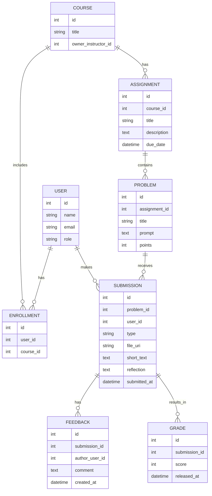

# Data Model

```mermaid
erDiagram
    USER ||--o{ ENROLLMENT : has
    %% a user can have many enrollments %%
    COURSE ||--o{ ENROLLMENT : includes
    %% a course can include many enrollments %%
    COURSE ||--o{ ASSIGNMENT : has
    %% a course has many assignments %%
    ASSIGNMENT ||--o{ PROBLEM : contains
    %% each assignment contains problems %%
    PROBLEM ||--o{ SUBMISSION : receives
    %% each problem can have many submissions %%
    USER ||--o{ SUBMISSION : makes
    %% a user makes submissions %%
    SUBMISSION ||--o{ FEEDBACK : has
    %% a submission can have feedback comments %%
    SUBMISSION ||--o{ GRADE : results_in
    %% a submission results in a grade %%

    USER {
      int id
      string name
      string email
      string role
      %% role = student, instructor, admin %%
    }

    COURSE {
      int id
      string title
      int owner_instructor_id
      %% instructor who owns the course %%
    }

    ENROLLMENT {
      int id
      int user_id
      int course_id
      %% connects users and courses %%
    }

    ASSIGNMENT {
      int id
      int course_id
      string title
      text description
      datetime due_date
      %% assignment belongs to a course %%
    }

    PROBLEM {
      int id
      int assignment_id
      string title
      text prompt
      int points
      %% problem belongs to an assignment %%
    }

    SUBMISSION {
      int id
      int problem_id
      int user_id
      string type
      %% file, short_text, or code+reflection %%
      string file_uri
      text short_text
      text reflection
      datetime submitted_at
      %% when submission was made %%
    }

    FEEDBACK {
      int id
      int submission_id
      int author_user_id
      text comment
      datetime created_at
      %% feedback linked to a submission %%
    }

    GRADE {
      int id
      int submission_id
      int score
      datetime released_at
      %% grade given to a submission %%
    }
```