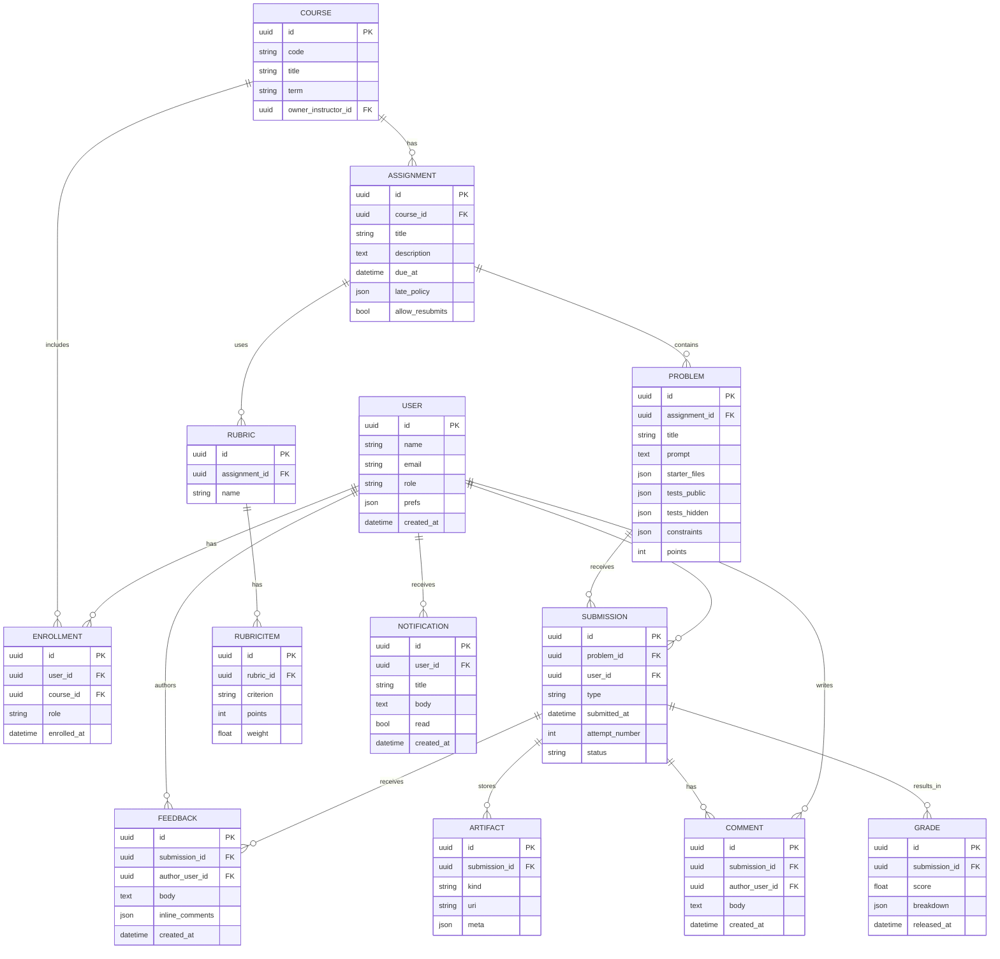

# Data Model (ERD — Major Nouns)

## Enum Values

### USER.role
- `learner`
- `instructor`
- `admin`

### ENROLLMENT.role
- `learner`
- `ta`
- `instructor`

### SUBMISSION.type
- `CODE`
- `CODE_VOICE`
- `NOTEBOOK`

### SUBMISSION.status
- `QUEUED`
- `RUNNING`
- `PASSED`
- `FAILED`

### ARTIFACT.kind
- `CODE`
- `LOG`
- `AUDIO`
- `TRANSCRIPT`
- `RESULTS`
- `DIFF`

## Notes

- **Code+Voice** is modeled by `SUBMISSION.type = CODE_VOICE` plus `ARTIFACT(kind = AUDIO | TRANSCRIPT)`.
- **Attempt history** is the sequence of `SUBMISSION.attempt_number` per user/problem; diffs stored as `ARTIFACT(kind=DIFF)`.
- **Autograder outputs** in `ARTIFACT(kind=RESULTS|LOG)`.

## Key Design Features

### Flexible Submission Types
The system supports multiple submission formats including traditional code, code with voice narration, and Jupyter notebooks.

### Comprehensive Feedback System
- Rubric-based grading with weighted criteria
- Inline code comments (stored as JSON mapping file:line to comment)
- General feedback text
- Discussion comments

### Artifact Storage
Uses signed URLs (`uri` field) for efficient storage of large files with metadata support (language, duration, etc.).

### Role Hierarchy
- Global user roles (system-wide permissions)
- Course-specific enrollment roles (course-level permissions)

### Constraints and Policies
- Problems support constraints (language requirements, time/memory limits)
- Assignments support flexible late policies via JSON configuration

### Attempt Tracking
Built-in versioning with attempt numbers and diff storage for tracking changes between submissions.
