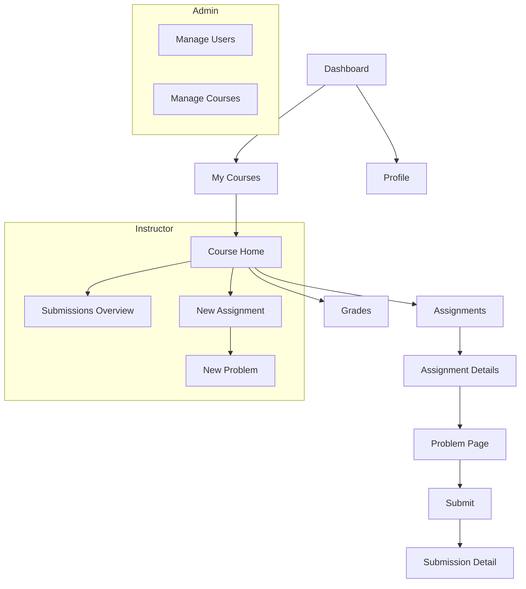

# Site Map

```mermaid
flowchart TD
    A[Dashboard] --> B[My Courses]
    B --> C[Course Home]
    C --> D[Assignments]
    D --> E[Assignment Details]
    E --> F[Problem Page]
    F --> G[Submit]
    G --> H[Submission Detail]
    C --> I[Grades]

    subgraph Instructor
      C --> J[Submissions Overview]
      C --> K[New Assignment]
      K --> L[New Problem]
    end

    subgraph Admin
      M[Manage Users]
      N[Manage Courses]
    end

    A --> O[Profile]
```
