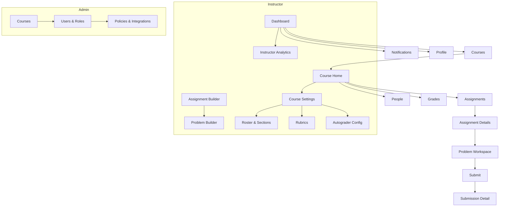

# Site Map (Frontend Pages)

Below is a high-level site map. Each page lists key child routes/components. A Mermaid diagram follows.

- **/** — Landing / Dashboard
  - `/courses` — My Courses
    - `/courses/:courseId` — Course Home
      - `.../assignments` — Assignment List
        - `.../assignments/:assignmentId` — Assignment Details
          - `.../problems/:problemId` — Problem Workspace (editor, tests)
            - `.../submit` — Submit (Code, **Code+Voice**, Notebook)
            - `.../submissions/:submissionId` — Submission Detail (autograder, audio, feedback)
      - `.../people` — Roster
      - `.../grades` — Gradebook (instructor) / My Grades (learner)
  - `/notifications`
  - `/profile`
- **Instructor**
  - `/instructor/courses/:courseId/manage` — Course Settings
  - `/instructor/assignments/new` — Assignment Builder
  - `/instructor/problems/new` — Problem Builder (tests, rubric)
  - `/instructor/analytics`
- **Admin**
  - `/admin/courses` — Course Provisioning
  - `/admin/users` — Users & Roles
  - `/admin/settings` — Policies & Integrations

