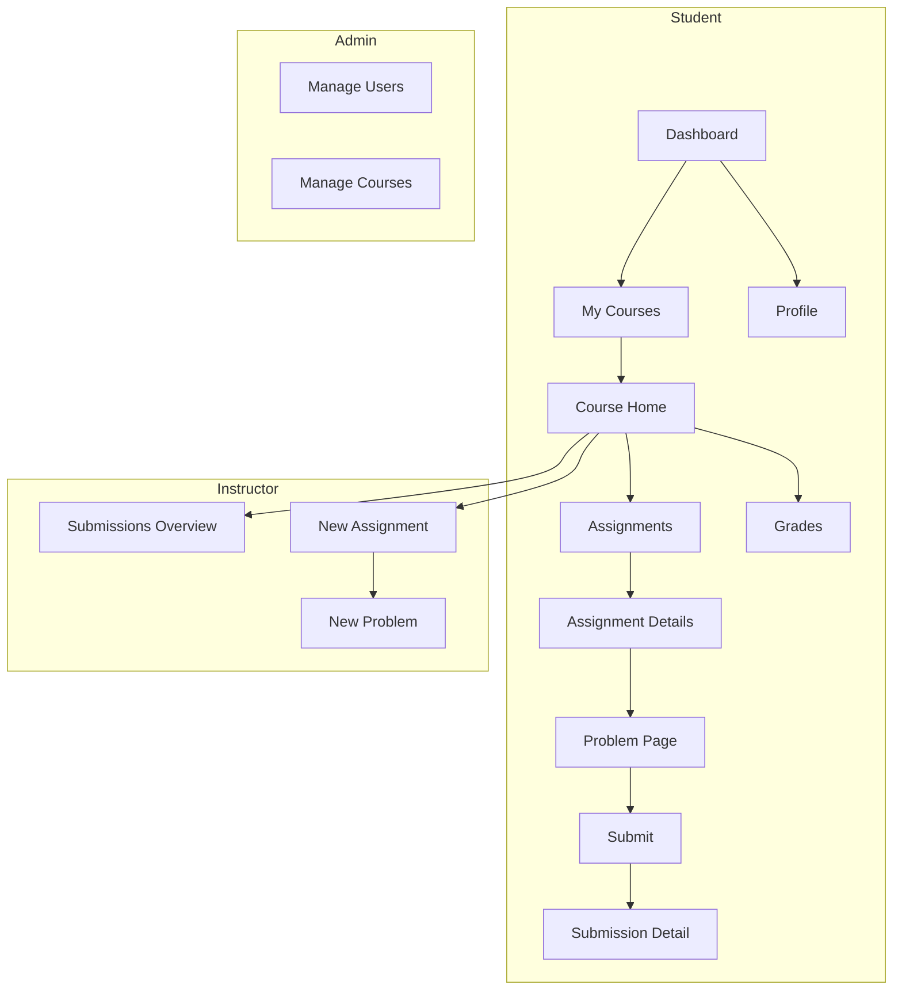

# Site Map

```mermaid
flowchart TD
    subgraph Student
    %% student-facing view %%
      A[Dashboard] --> B[My Courses]
      %% entry point is the dashboard %%
      B --> C[Course Home]
      %% list of enrolled courses %%
      C --> D[Assignments]
      %% all assignments for the courses %%
      D --> E[Assignment Details]
      %% description, problems, due date %%
      E --> F[Problem Page]
      %% instructions + workspace %%
      F --> G[Submit]
      %% submission page to turn in the work %%
      G --> H[Submission Detail]
      %% view feedback, grade, assignment history, etc %%
      C --> I[Grades]
      %% overall gradebook for the student %%
      A --> O[Profile]
      %% personal info, settings %%
    end

    subgraph Instructor
    %% instructor view %%
      C --> J[Submissions Overview]
      %% view submissions for all courses, students, etc %%
      C --> K[New Assignment]
      %% create and assign assignment for a course %%
      K --> L[New Problem]
      %% while creating an assignment, instructors can add problems/questions %%
    end

    subgraph Admin
    %% admin panel - full level overview for managing courses and users %%
      M[Manage Users]
      N[Manage Courses]
    end
```