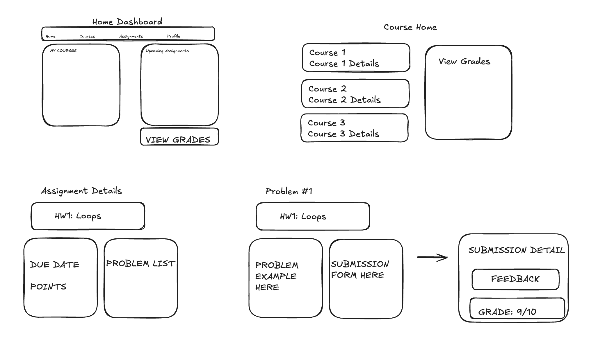

# Wireframe

This wireframe shows the main student flow through the LMS on one page:  
**Dashboard → Course Home → Assignment Details → Problem Page → Submission Detail.**

**Explanation:**
- **Dashboard**: Top nav, My Courses panel, Upcoming Assignments panel.  
- **Course Home**: Course list and Grades access.  
- **Assignment Details**: Assignment title, due date/points, list of problems.  
- **Problem Page / Submit**: Prompt on left, submission form on right.  
- **Submission Detail**: Shows feedback and grade for a submission.  